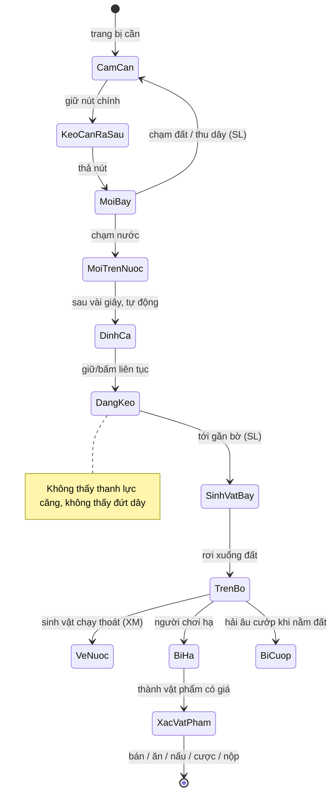

> **NGHIÊN CỨU LỊCH SỬ V1.** Giữ nội dung gốc để tham khảo; chưa tái xác minh toàn bộ dữ kiện tại bản 2. Đây không phải chỉ dẫn triển khai. Android, chơi đơn trước, không đói, không lootbox, local save và cốt truyện cũ đã được thay bằng yêu cầu bản 2 trong `00_START_HERE.md` và `11_DECISIONS_AND_UNKNOWNS.md`. Phiên bản/giá/chính sách/capability công cụ phải kiểm tra lại khi dùng.

# 03 — PHÂN TÍCH GAME THAM CHIẾU "HOW TO FISH"

> **Lớp tài liệu:** *Game tham chiếu hoạt động như thế nào.* Không có quyết định cho game mới ở đây — mọi điều quan sát được **không tự động trở thành yêu cầu**. Phần chuyển hóa sang game mới nằm ở `04_GAME_DESIGN.md` (bảng nối §3).
> **Phạm vi phiên bản:** 1.0.0 (20/08/2026) → 1.0.12 (04/09/2026). Mỗi khẳng định dẫn mã `EV-xxx` (xem `02_EVIDENCE.md`); nhãn [XM] = đã xác minh, [SL] = suy luận, [CR] = chưa rõ.

## 1. Tóm tắt nhận dạng

How to Fish là game **góc nhìn thứ nhất, 3D low-poly, vật lý**, chơi đơn hoặc co-op trực tuyến (1–4, kỹ thuật tối đa 8) trên PC/Steam, giá rẻ (7,99 USD; 99.000 ₫ ở Việt Nam). Người chơi bị dạt vào một hòn đảo và phải "học câu cá" để về nhà: câu sinh vật, **hạ** chúng bằng tay/vũ khí, **bán** để mua đồ tốt hơn, làm nhiệm vụ và đánh boss để mở 5 đảo liên tiếp [XM, EV-001, EV-020, EV-049, EV-050]. Làm bởi đội 2 người trong ~1 năm [XM, EV-008]; bán 1 triệu bản trong 2 ngày [XM, EV-009].

## 2. Trải nghiệm chủ đạo và lý do người chơi thấy vui

**Cảm giác chủ đạo:** *"tai nạn hài hước có kiểm soát"* — một hoạt động vốn yên bình (câu cá) bị bẻ lái thành trò hỗn loạn vật lý, bạo lực hoạt hình và cờ bạc vô tri, trình bày bằng giọng tỉnh bơ [SL từ EV-059, EV-080, EV-082].

| Yếu tố tạo niềm vui | Bằng chứng | Nhãn |
|---|---|---|
| **Sự tương phản**: câu cá thư giãn ↔ súng, nổ, trick shot | Đánh giá tích cực nhắc súng/trick 12/40, hài/meme 11/40 (EV-080); trailer dựng nhịp theo tương phản này (S12) | XM (trong mẫu) |
| **Hỗn loạn chung với bạn bè** | 18/40 đánh giá tích cực nhắc co-op (EV-080); reviewer: "khoảnh khắc buồn cười không kịch bản" (S25) | XM |
| **Khoảnh khắc "cá bay"**: sinh vật bị giật lên trời, có cửa sổ ngắn để làm trò | Ảnh SS3, trick "hạ trên không" (EV-026, EV-031) | XM |
| **Phong cách = tiền**: trick nhân dồn giá bán | EV-031; thảo luận cộng đồng về đạt ×6 trở lên (S07) | XM |
| **Tiến trình rõ**: mỗi đảo một chuỗi nhiệm vụ → boss → đảo mới | EV-049 | XM |
| **Rủi ro vui**: cờ bạc bằng cá, hải âu cướp đồ, tự nổ chết | EV-046, EV-038, S10 (chết vì thuốc nổ) | XM |
| **Giá rẻ, phiên ngắn** | 7/40 đánh giá khen giá (EV-080) | XM |

**Kỹ năng vs ngẫu nhiên:** phần *câu* gần như không đòi kỹ năng (cá tự cắn, không lực căng — EV-022, EV-024); kỹ năng dồn vào *sau khi cá lên bờ*: ngắm, di chuyển, xoay 360, canh viên đạn cuối, bố trí thuốc nổ (EV-031) và né đòn boss (EV-051). Ngẫu nhiên nằm ở loài/biến thể dính câu (EV-041, EV-043) và roulette (EV-046) [SL].

**Thư giãn vs thử thách:** đầu đảo thư giãn (nhạc nhẹ, cày cá nhỏ), đỉnh thử thách ở boss có đồng hồ (EV-052, EV-073). Chơi đơn, thử thách boss bị chê là quá gắt (EV-083) và nhà phát triển phải nerf boss nhiều lần + thêm chế độ Easy (EV-053, EV-054) [XM].

**Động lực quay lại:** mở đảo mới, vũ khí mới; sưu tầm biến thể "drip" và hoàn thành danh mục; 28 thành tựu Steam (S01); chơi lại với nhóm bạn khác (EV-043, EV-044). Điểm yếu: nội dung chỉ ~3,5–7 giờ và vòng lặp lặp lại theo từng đảo (EV-057, EV-081) [XM].

## 3. Vòng lặp ba cấp

### 3.1. Một lần câu (khoảng 10–60 giây — [SL] ước lượng từ video S09, S10, chưa đo) · các bước [XM] trừ chỗ ghi khác
1. Chọn cần + mồi phù hợp đảo (EV-041) → 2. Giữ để kéo cần ra sau, thả để quăng (EV-021) → 3. Chờ vài giây, cá tự cắn, báo chữ + âm (EV-022) → 4. Giữ/bấm liên tục để kéo, không có lực căng (EV-024) → 5. Sinh vật bay lên và rơi xuống bờ, giãy (EV-026) → 6. Sinh vật chạy về nước / tấn công / nằm giãy (EV-027) → 7. Hạ bằng tay/vũ khí, trick nhân giá (EV-028, EV-031) → 8. Nhặt xác → (tùy chọn) nấu (EV-037) → 9. Bán vào miệng NPC / ăn / cược / dùng làm mồi / nộp nhiệm vụ (EV-034, EV-036, EV-046, EV-049).
Rủi ro trong vòng: sinh vật thoát về nước, hải âu cướp khi để đất (EV-038), bị cắn/đánh.

### 3.2. Một phiên chơi (30–90 phút) [SL từ S10, S09]
Đến đảo → nói chuyện NPC, nhận yêu cầu → cày cá mồi rẻ để có tiền → mua mồi cấp đảo + vũ khí/nâng cấp → làm yêu cầu để có mồi đặc biệt → gọi boss (có thể chết vài lần) → nộp bộ phận boss → nhận tọa độ/chìa khóa → đi thuyền (dùng radar) sang đảo sau. Speedrun cho thấy khung tối thiểu ~2 phút/đảo (S09); lượt chơi thường ~33 phút cho đảo 1 (EV-060, tin cậy thấp).

### 3.3. Dài hạn
5 đảo → boss cuối → cảnh kết → thuyền lật về đầu game (EV-056). Sau kết thúc: hoàn thành danh mục biến thể, thành tựu, chơi co-op lại [XM]. Nhà phát triển hứa thêm nội dung (S31) [XM].

## 4. Các giai đoạn trải nghiệm

| Giai đoạn | Điều xảy ra | Bằng chứng |
|---|---|---|
| **Phút đầu (0–5')** | Tỉnh dậy cạnh xác thuyền cháy → hộp hướng dẫn từng động từ (đi, nhìn, nhặt, ăn, bán, mua, câu, hạ, xem giá, danh mục, nói chuyện) → tự do chơi. Tiền đầu tiên đến từ việc nhặt nghêu và "bán" cho NPC | EV-058, S10 00:01–04:16 |
| **Đã hiểu cơ chế (5'–1h)** | Nhận ra niềm vui ở trick và thuốc nổ, bắt đầu tối ưu tiền; gặp boss đầu, thường chết vài lần | EV-031, EV-060 |
| **Đã mở nhiều nội dung (1h+)** | Vũ khí tự động/bắn tỉa, nấu tăng giá, casino, radar, boss nhiều pha; vòng lặp lặp lại cấu trúc cũ ⇒ một số người thấy nhàm | EV-046, EV-051, EV-081 |

## 5. Phân rã hệ thống

| Hệ thống | Mô tả quan sát | Nhãn | Bằng chứng |
|---|---|---|---|
| Di chuyển & camera | FPS: WASD + chuột, nhảy; camera thứ nhất; cảnh kết góc thứ ba | XM | S09, S10 |
| Tương tác | Nhìn vào vật + phím tương tác: nhặt, nói chuyện, mua, lái thuyền; prompt nổi | XM | EV-058, EV-072 |
| Chọn vị trí câu | Bờ, cầu gỗ, xác tàu; mỗi đảo có loài riêng; boss gọi ở vị trí gần NPC/bờ | XM (có vị trí) / CR (có vùng câu đặc biệt không) | S11, S16 |
| Dụng cụ & mồi | Cần câu cua → cần câu thường; mồi theo cấp; ô mồi có số lượng | XM | EV-040, EV-041 |
| Chuỗi câu | Quăng → chờ → tự cắn → kéo → bay lên bờ | XM | EV-021…EV-026 |
| Hành vi sinh vật | Giãy, chạy về nước, tấn công; boss bay, gọi đàn, chuyển pha | XM | EV-027, EV-051 |
| Độ hiếm & điều kiện xuất hiện | Loài theo đảo + cần + mồi; biến thể drip ngẫu nhiên; cờ endangered | XM (cấu trúc) / CR (xác suất) | EV-041, EV-043, EV-045 |
| Kích thước sinh vật | Từ nghêu đến cá voi; boss rất lớn | XM | S13, S11 |
| Inventory & trang bị | Hotbar số + ô mồi; mua thêm ô; cầm 1 vật trên tay; ném | XM | EV-040 |
| Cửa hàng & thu nhập | Hàng treo dạng vật thể; bán bằng cách đưa vào miệng NPC; giá theo loài × trick × nấu | XM | EV-034, EV-072, EV-031, EV-037 |
| Nâng cấp & mở khóa | Vũ khí, phụ kiện, sát thương, ô túi, động cơ thuyền; đảo mở theo nhiệm vụ | XM | EV-029, EV-048, EV-049 |
| Bản đồ & di chuyển xa | Thuyền + radar theo tọa độ NPC; không thấy bản đồ tổng | XM (radar) / CR (bản đồ) | EV-047 |
| Thời gian & thời tiết | Không tìm thấy bằng chứng về chu kỳ ngày/đêm hay thời tiết | CR | EV-066 |
| Nhiệm vụ | Chuỗi nhiệm vụ NPC mỗi đảo | XM | EV-049 |
| Bộ sưu tập & phần thưởng | Danh mục loài/biến thể; máy Reel of Fortune đổi skin; 28 thành tựu | XM | EV-043, EV-044, S01 (số thành tựu) |
| Nấu ăn | Vỉ nướng/dung nham, ×1,5, cháy khi quá lâu | XM/SL | EV-037 |
| Sinh tồn | Máu + đói; ăn sinh vật; chết → hồi sinh ở bờ | XM | EV-036, EV-055 |
| Mối đe dọa môi trường | Hải âu cướp đồ; sinh vật tấn công | XM | EV-038, EV-027 |
| Cờ bạc | Roulette bằng vật phẩm | XM | EV-046 |
| Hướng dẫn & phản hồi | Hộp hướng dẫn, prompt, popup giá trị/trick, thông báo loài mới, âm thanh | XM | EV-058, EV-033 |
| Lưu/tải | Tự lưu mỗi phút, lưu khi thoát, vật phẩm rơi được lưu, Steam Cloud | XM | EV-061, EV-039 |
| Tạm dừng & gián đoạn | Menu tạm dừng có thoát ra menu chính; lỗi mất kết nối/hỏng save từng xảy ra | XM | S09, S03 |
| Nhiều người chơi | Lobby Steam, tối đa 8, tùy chọn friendly fire/chia tiền | XM/SL | EV-063 |

## 6. Đặc tả cơ chế câu cá cốt lõi (game gốc)

| Mục | Nội dung | Nhãn |
|---|---|---|
| **Mục đích** | Biến việc "lấy sinh vật ra khỏi nước" thành bước chuẩn bị nhanh cho phần hạ/bán; tạo khoảnh khắc sinh vật bay lên | SL |
| **Đầu vào** | Nút chính: giữ (kéo cần ra sau) → thả (quăng); nút chính giữ/bấm liên tục (kéo); nút phụ/Q (thả sinh vật); hướng nhìn quyết định điểm rơi mồi | XM (EV-021, EV-024) / CR (phím thả — CF-04) |
| **Điều kiện bắt đầu** | Đang cầm cần; nhìn về phía nước; có mồi (có mồi miễn phí cấp thấp) | XM (cầm cần) / SL (mồi) |
| **Trạng thái** | Chờ → kéo cần ra sau → mồi bay → mồi trên nước chờ → dính → đang kéo → sinh vật bay lên → sinh vật trên bờ | XM |
| **Chuyển trạng thái** | Thả nút → mồi bay; mồi chạm nước → chờ; hết thời gian chờ (vài giây) → dính; giữ/bấm → khoảng cách giảm; tới gần bờ → sinh vật bị giật lên | XM / SL (điều kiện "gần bờ") |
| **Phản hồi hình/tiếng** | Cần cong, dây vòng cung, tiếng vút, tiếng "tõm", gợn nước; dính: âm "ting" + chữ; kéo: tiếng guồng; lên bờ: tiếng quẫy; boss: nhạc đổi + thanh máu | SL (âm thanh qua Gemini) |
| **Kết quả** | Sinh vật sống trên bờ (hoặc boss bắt đầu trận); lần đầu bắt loài mới được ghi vào danh mục | XM |
| **Trường hợp biên** | Quăng trúng đất; mồi không hợp đảo → cá "không có ích" cắn (EV-041, S15 mẹo 11); sinh vật chạy về nước; hải âu cướp; boss bỏ trốn khi hết giờ (SL); nhiều người cùng câu/cùng nhặt (lỗi đã vá, EV-039) | XM / SL |

### Sơ đồ trạng thái một lần câu (game gốc, suy ra từ bằng chứng)

## 7. Điều gì tạo cảm giác điều khiển tốt (phân tích)

| Yếu tố | Quan sát | Nhận định | Nhãn |
|---|---|---|---|
| Độ trễ phản hồi | Quăng/kéo phản hồi ngay theo nút; cá cắn sau vài giây | Chu trình ngắn giữ nhịp nhanh; thời gian chờ đủ để nghe/nhìn nhưng không chán | SL |
| Chuyển động cần & dây | Cần cong khi kéo ra sau; dây vòng cung; cá treo đầu dây (SS3) | Dây là "sợi chỉ" nối người chơi với mục tiêu, làm khoảnh khắc giật lên dễ đọc | SL |
| Lực kéo | Không có lực căng; giữ/bấm liên tục | Dễ tiếp cận nhưng bị chê lặp lại (EV-082) | SL |
| Camera | FPS, sinh vật bay qua tầm nhìn, người chơi ngửa lên trời để bắn | Điểm nhìn thứ nhất khiến "cá bay qua mặt" rất mạnh | SL |
| Animation | Tay FP đơn giản, sinh vật ragdoll/giãy | Vật lý làm phần "diễn", giảm chi phí animation tay | SL |
| UI | Popup trick xếp chồng, số tiền nổi, thanh boss | Phản hồi phần thưởng tức thì, cộng dồn nhìn thấy được | XM (EV-033) |
| Âm thanh | "Ting" khi dính, guồng, quẫy, súng arcade, âm nuốt + leng keng khi bán | Âm thanh báo trạng thái (dính, bán) là tín hiệu quyết định | SL (EV-074) |

## 8. Mỹ thuật, model, hình ảnh, âm thanh

Bảng tham chiếu có nguồn và ảnh: `references/ref_visual_references.md`.

| Khía cạnh | Quan sát | Nhãn | Nguồn |
|---|---|---|---|
| Phong cách | 3D low-poly phẳng, cách điệu vừa; không texture chi tiết | XM | S13 |
| Silhouette & tỷ lệ | Nhân vật thân dài, đầu tròn, mắt to; sinh vật hình khối rõ (cá nóc cầu gai, cá bạc thon); boss rất lớn | XM | S13 SS2, SS3 |
| Mức chi tiết | Cần câu có guồng, súng có ống ngắm — đủ nhận dạng ở góc nhìn thứ nhất; môi trường đơn giản | XM | S13 |
| Màu & tương phản | Trời xanh nhạt, biển xanh, cát kem, cây xanh bão hòa; nhân vật áo cam nổi bật trên nền | XM | S13 |
| Vật liệu & ánh sáng | Mặt trời có bóng đổ, ánh sáng mềm; than/lửa phát sáng | XM | S13 SS4 |
| Mặt nước | Lưới tam giác phẳng thấy rõ, viền bọt trắng ở bờ | XM | S13 SS4, SS7 |
| Góc nhìn & bố cục | FPS; vật phẩm tay phải chiếm góc dưới phải; mục tiêu ở giữa | XM | S13 |
| Animation & hiệu ứng | Ragdoll, khối "máu" voxel, khói khối cầu, số sát thương nổi, vỏ đạn | XM | S13 |
| UI | Xem EV-071; chữ trắng viền, font tròn thân thiện; icon render 3D | XM | S13 SS2 |
| Âm nhạc | Nhạc nhẹ theo đảo; nhạc dồn dập khi boss; synthwave cảnh kết; radio | XM/SL | EV-073 |
| Âm thanh tương tác | Tín hiệu dính câu, tiền, cảnh báo hải âu | SL | EV-074 |
| Giọng NPC | Âm lảm nhảm + bóng chữ | XM | EV-059 |

## 9. Điểm mạnh và điểm yếu (theo phản hồi)

| Điểm mạnh | Điểm yếu |
|---|---|
| Tương phản hài hước; hỗn loạn co-op; trick nhân giá; cờ bạc vô tri; giá rẻ; chạy nhẹ (EV-080, EV-065) | Ngắn; vòng lặp lặp lại theo từng đảo; phần câu đơn giản; boss gắt khi chơi đơn; lỗi save/mạng lúc ra mắt; hệ số không được giải thích (EV-081–EV-083, EV-061, EV-032) |

## 10. Lưu ý chuyển giao — các chi tiết **không** nên mặc định mang sang game mới *(Đề xuất cho game mới; quyết định chính thức nằm ở `04` và `11`)*

- Súng thật, "máu" voxel, bia rượu, roulette kiểu casino: là nhận diện của game gốc và kéo độ tuổi lên; cần cân nhắc với nền tảng đích (xem `04` §4 và `11` Q-003, Q-004).
- Nhân vật đầu trọc da vàng áo liền quần cam, "nhét vào miệng NPC", tên boss/loài, lời thoại: thuộc bản sắc sáng tạo của game gốc → **không sao chép**.
- Radar tọa độ, 5 đảo, 10 boss: quy mô của đội 2 người sáng lập (cộng thuê ngoài âm thanh, bản địa hóa) làm ~1 năm (EV-008) — lớn hơn nhiều so với năng lực dự án mới.
