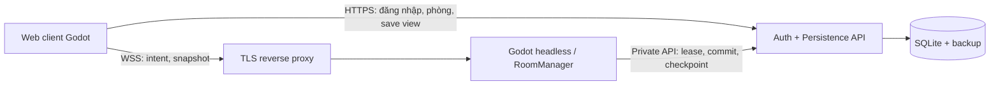

# 07 — Thiết kế kỹ thuật v2

Đây là đặc tả để Claude Code triển khai, **chưa phải mã game đã chạy**. Yêu cầu trong cuộc trò chuyện ngày 27/09/2026 thay thế hướng chơi đơn/Android/lưu cục bộ ở ZIP cũ. Bản đầy đủ phải có web PC chuột/phím, Godot 3D góc nhìn thứ nhất, phòng 1–4 người, ba đảo, ba boss, 15 loài thường, đói, hộp thưởng miễn phí, tài khoản và lưu máy chủ. Cách đếm 15 loài thường + ba boss là giả định được công khai; không tự cắt bớt nội dung nếu chưa đủ thời gian.

## 1. Nền tảng và giới hạn đã kiểm tra

| Thành phần | Lựa chọn triển khai | Cách kiểm chứng |
|---|---|---|
| Engine | Godot 4 stable đã có trên máy, GDScript có kiểu; ghi chính xác version/hash và export templates tương ứng vào `toolchain.lock.json` khi bắt đầu | Chạy version, import, headless test và web export thật trước khi khóa version. Không kế thừa khẳng định “4.7.2” của tài liệu cũ |
| Đồ họa | Compatibility, WebGL 2, low-poly, ánh sáng đơn giản, ít bóng thời gian thực | Web build trên Chrome/Edge và Firefox PC; máy phát triển 8 GB RAM |
| Web export | Single-thread, không GDExtension, tên xuất `index.html`; trình duyệt cần WebAssembly/WebGL2 | Không dùng C# hoặc renderer Forward+/Mobile cho bản web |
| Máy chủ game | Cùng version Godot, headless native, `WebSocketMultiplayerPeer` | Browser là WS client; máy chủ chạy ngoài trình duyệt |
| Tài khoản/lưu | Python + FastAPI + SQLite trên một máy chủ, một tiến trình writer; dependency khóa phiên bản sau khi kiểm tra | Đây là quyết định thiết kế để giảm công vận hành, không phải dịch vụ đã được cài/triển khai |
| Public | HTTPS cho web/API, WSS cho game; reverse proxy TLS đến dịch vụ chỉ bind nội bộ | itch.io chứa web build; không được coi itch.io là nơi chạy database hoặc Godot headless |

Các hạn chế web trên được đối chiếu với [Godot: xuất web](https://docs.godotengine.org/en/stable/tutorials/export/exporting_for_web.html). Khả năng tạo client/server được ghi ở [WebSocketMultiplayerPeer](https://docs.godotengine.org/en/stable/classes/class_websocketmultiplayerpeer.html); [headless server](https://docs.godotengine.org/en/stable/tutorials/export/exporting_for_dedicated_servers.html) chạy bằng native export. Liên kết `stable` có thể thay đổi; Claude lưu bản engine thực nghiệm, ngày đối chiếu và kết quả vào báo cáo môi trường.

Ngân sách phát sinh bằng 0. Nếu chưa có máy chủ truy cập được từ Internet, lưu bền vững, TLS và người vận hành, vẫn hoàn thành code, local server, LAN test, gói web/server, tài liệu triển khai; ghi `PUBLIC_ONLINE_BLOCKED` cho phần phát hành. Không nhận phần mô phỏng/offline là đã đáp ứng tài khoản cloud hoặc online bốn người. Không tự mua tên miền `.io`, thuê máy chủ, nhập thẻ, kích hoạt trial trả phí hoặc bật quảng cáo. Điều kiện phát hành ở `15_DEPLOYMENT_AND_COST.md`.

## 2. Cấu trúc dự án được tạo tự động

Claude chọn tên thư mục chưa tồn tại trong workspace, ví dụ `ca-bay/`; nếu đã có dự án phù hợp thì đọc và tiếp tục, không ghi đè. Bố cục dưới khớp `13_CLAUDE_AUTOMATION.md`; chỉ có một thư mục dữ liệu chuẩn:

```text
ca-bay/
  CLAUDE.md
  README.md
  toolchain.lock.json
  project.godot
  export_presets.cfg
  .claude/agents/
  data/{content,contracts,loc,schemas,samples}/
  client/{scenes,scripts}/
  ui/                         # theo đường dẫn res://ui trong asset registry
  shared/{gameplay,content,protocol}/
  server/
    gameplay/
    backend/
      app/{auth,rooms,persistence,models}/
      migrations/
      tests/
      requirements.lock.txt
      .env.example
    ops/{local,public,backup}/
  assets/{models,textures,audio,fonts}/
  incoming/
  prompts/
  handoff/
  tasks/
  tools/{validate,build,asset_generation}/
  tests/{godot,integration,web,fixtures}/
  docs/{decisions,references}/
  reports/
  build/{web,server}/
  release/
```

`build/`, secrets, tài khoản test, database thật, `.godot/`, môi trường Python không commit. `.env.example` chỉ có tên biến và placeholder. Dùng `.gdignore` cho backend Python, docs, incoming, reports và build để tránh import dư. Server bundle và client bundle khác danh sách export; không đóng gói mật khẩu, secret dịch vụ, SQLite, log người dùng hoặc recovery code vào `.pck`.

## 3. Kiến trúc và quyền ghi



- **Client:** chuột/phím, camera, HUD VI/EN, dự đoán di chuyển ngắn, hình ảnh/âm thanh. Gửi ý định: quăng, kéo, đánh, nhặt, bán, ăn, mở hộp. Không gửi “tôi có thêm tiền”, “boss đã chết”, xác suất hay kết quả trúng thưởng.
- **RoomManager:** một tiến trình Godot ban đầu, nhiều room cách ly bằng `room_id`; mặc định chỉ mở một room tối đa bốn người để nghiệm thu máy 8 GB. Mỗi room chỉ giữ một đảo hoạt động; chuyển đảo đi cả nhóm. Gửi snapshot theo danh sách peer của room, không broadcast toàn server.
- **Cách ly vật lý:** trước khi bật nhiều room, mỗi room nằm trong một `SubViewport` sở hữu `World3D` riêng (`own_world_3d=true`) để có physics space riêng. Headless không render viewport; gameplay, physics queries và navigation phải dùng world của room đó. Không đặt nhiều room chồng tọa độ trong World3D chung rồi chỉ lọc gói mạng. Test NET-02 đặt hai cá khác room cùng tọa độ, xác minh không va chạm/hit/raycast chéo và không rò snapshot; chưa pass thì giới hạn một room.
- **RoomSimulation:** mô phỏng authoritative về cá, dây câu, vật thể, công cụ, boss, đói và kiểm tra khoảng cách/cooldown. Mỗi tài khoản có tối đa một gameplay lease đang hoạt động.
- **Persistence API:** cơ quan ghi bền vững duy nhất; kiểm tra lease, version, idempotency, giao dịch inventory/tiền/thưởng; xử lý tài khoản và mã phục hồi. Godot gọi qua loopback hoặc private network đã xác thực dịch vụ. HTTP endpoint nội bộ không đi qua public proxy.
- **Chủ phòng:** có quyền đặt tên, mời, bắt đầu và đề nghị đổi đảo; không có quyền tính kết quả hay sửa save. Chủ phòng rời thì server giao quyền cho thành viên ở lâu nhất, room tiếp tục.

Node gốc `Game` có `Network`, `ContentDB`, `ClientPresentation`, `ServerRooms`; các RPC nằm dưới đường dẫn node cố định, signature đồng nhất giữa client/server. `SceneMultiplayer.allow_object_decoding` giữ false. Chỉ nhận Dictionary/primitive có giới hạn và schema rõ; không deserialize script, resource hoặc Node từ mạng. Luồng xác thực trước kết nối gameplay dùng [SceneMultiplayer auth callback](https://docs.godotengine.org/en/stable/classes/class_scenemultiplayer.html) của version đã pin.

## 4. Tài khoản, phục hồi và kết nối phòng

1. `POST /v1/auth/register`: username chuẩn hóa chữ thường ASCII 3–24 ký tự, display name Unicode 1–32 ký tự, password 12–128 ký tự. Server sinh account UUID, mật khẩu băm chậm với salt riêng, một bộ mã phục hồi. UI hiện mã **một lần**, cho tải file; không tự gửi email vì chưa có dịch vụ email.
2. Khuyến nghị ban đầu `hashlib.scrypt` với `n=131072,r=8,p=1`, salt 16 byte, output 32 byte, giới hạn memory thích hợp; benchmark trên host và giới hạn hai hash job đồng thời. Lưu thuật toán/tham số/salt cùng digest, so sánh constant-time; không dùng SHA256(password). Nếu runtime thiếu scrypt thì dùng thư viện Argon2id được kiểm tra và pin, không tự hạ xuống hash nhanh. [Python mô tả KDF cho password](https://docs.python.org/3/library/hashlib.html#key-derivation).
3. `POST /v1/auth/login`: token bearer ngẫu nhiên tối thiểu 32 byte, server chỉ lưu hash; access token 15 phút, refresh token luân phiên tối đa 12 giờ. Tokens giữ trong memory của phiên; mặc định phải đăng nhập lại sau khi đóng trang. Không phụ thuộc cookie bên thứ ba trong iframe itch.io.
4. `POST /v1/auth/refresh`, `POST /v1/auth/logout`: refresh tiêu thụ token cũ một lần; reuse làm mất hiệu lực session tương ứng. Logout thu hồi cả session/ticket/lease. Đổi mật khẩu và recovery thu hồi mọi session của tài khoản.
5. `POST /v1/auth/recover`: username + recovery code chưa dùng + password mới. Server hash recovery code, tiêu thụ một lần trong transaction, cấp bộ code mới. Không có code và không có email đã xác minh thì UI nói rõ không thể tự phục hồi, không dùng câu hỏi bảo mật đoán được.
6. Danh sách phòng có mã mời, tối đa bốn slot; không tự tạo chat tự do hoặc voice chat. Player thứ năm bị từ chối. Room API chỉ trả dữ liệu công khai, không lộ username đăng nhập hay save của người khác.
7. Client tạo/join room qua HTTPS, xin `POST /v1/rooms/{room_id}/ticket`. Ticket dùng một lần, TTL 30 giây, ràng buộc account, room, session và protocol. Ticket trao trong **auth message đầu tiên qua WSS**, không URL/query, không long-lived bearer trong socket hoặc log. Hoàn thành auth trong 5 giây; trước đó không tạo player hay nhận gameplay RPC.
8. Godot hỏi private API để consume ticket atomically và lấy lease/fencing epoch. Xác thực xong server gửi `session.accepted` + `state.snapshot`; UI chỉ cho chơi khi content/protocol hash phù hợp.

`DELETE /v1/account` yêu cầu access token và xác nhận mật khẩu hiện tại trong body, chỉ nhận sau lần xác thực lại trong 5 phút. UI nêu rõ xóa vĩnh viễn tiến trình, xác nhận riêng; server thu hồi session/ticket/lease, ngắt room và xóa/anonymize dữ liệu tài khoản của chính người gửi trong transaction. Không nhận account_id tùy ý để xóa người khác. Backup đã lưu được luân phiên hết hạn theo chính sách ở `15_DEPLOYMENT_AND_COST.md`; log vận hành không giữ username/token và không được hứa dữ liệu biến mất khỏi mọi backup ngay lập tức. Mã phục hồi vẫn dùng được để đặt mật khẩu mới trước khi yêu cầu xóa nếu người dùng quên mật khẩu.

API giới hạn register/login/recover theo IP và account với backoff; giá trị khởi đầu 5 lần thất bại/account/5 phút, 20 lần/IP/5 phút, không khóa vĩnh viễn để kẻ khác phá tài khoản. Body auth tối đa 8 KiB, không log password/token/recovery. CORS chỉ allow các origin thật đã quan sát từ web iframe và domain riêng; không wildcard có credentials. WebSocket `Origin` được kiểm tra ở proxy/server và ticket vẫn là bắt buộc. [FastAPI CORS](https://fastapi.tiangolo.com/tutorial/cors/) giải thích origin gồm scheme, hostname và port; phải test origin thực từ itch.io.

## 5. Networking, reconnect, AFK

Các giá trị cố định bước đầu nằm trong `data/contracts/network_contract.json`: tick mô phỏng 30 Hz; gửi input tối đa 20 Hz; snapshot 10 Hz; buffer nội suy 100 ms; timeout heartbeat 15 giây; reconnect grace 90 giây; payload client 8 KiB; snapshot 64 KiB chia chunk khi cần. Đây là ngân sách cần đo, không phải benchmark đã đạt.

Transport WebSocket là ordered/reliable qua TCP; đặt RPC reliable và không giả định kênh “unreliable” loại bỏ head-of-line blocking. Gộp input chưa gửi, giới hạn queue, cắt peer quá chậm. Dự đoán camera/chuyển động ở client; server xác nhận vị trí. Cá/boss và hit dùng server physics, không lockstep physics giữa máy. Chỉ cho rewind hit tối đa 150 ms nếu đã có test; chưa có thì dùng khoảng dung sai nhỏ theo dữ liệu và đo latency.

`seq` tăng trong một `connection_id`; `op_id` UUID không đổi khi retry giao dịch bền vững. `request_id` dùng để đối chiếu phản hồi. Nguồn account lấy từ authenticated peer, không tin account ID client gửi. Server kiểm tra room, epoch, quyền, cooldown, range, finite numbers, enum/ID hợp lệ. Client chỉ gửi input không nhận snapshot người khác làm quyền ghi.

Mất focus: UI mở pause chỉ khóa input/camera và hiện chữ “Phòng vẫn tiếp tục”. Không gọi pause toàn SceneTree ở server. Sau 120 giây không input có ý nghĩa, server cho player AFK, dừng hao đói và hủy thao tác câu; không phát thưởng cho AFK. Mất kết nối: hủy dây câu, tách player khỏi va chạm chiến đấu, dừng hao đói, giữ slot/lease 90 giây. Vật đã ghi nhận nằm trong inventory/escrow; cá chưa nhặt chưa nhận thưởng. Reconnect xin ticket mới rồi nhận full snapshot, không replay input cũ. Hết grace giải phóng slot và lease; join sau tạo player ở bến an toàn. Không trừ đói theo giờ máy hoặc khoảng thời gian offline.

Đăng nhập thiết bị B vẫn xem save được khi A đang chơi. Chọn “Chuyển phiên chơi sang thiết bị này” sẽ nâng lease epoch trong một transaction, thu hồi A trước khi cấp B; A phải trở về màn hình login/lobby. Mọi commit mang epoch cũ bị từ chối, kể cả A còn kết nối. Không cho hai bản tiến trình cùng ghi theo kiểu “save cuối thắng”.

## 6. Gameplay authoritative và đủ phạm vi

### 6.1. Câu, cá và công cụ

Máy trạng thái cần câu: `IDLE → CHARGING → CASTING → WAITING → BITING → REELING → LAUNCHED → IDLE`. Bỏ câu, đổi công cụ, mất mạng, player KO đều đi qua `CANCELLED` và cleanup một lần. Server chọn loài theo spawn table của vùng, mồi, trạng thái unlock; server giữ thời điểm bite và strain. Client chỉ báo giữ/thả/kéo. Giới hạn mỗi player một dây; bốn người được câu độc lập.

Cá: `HOOKED → AIRBORNE → LANDED → STUNNED → WORLD_ITEM` hoặc `ESCAPED`. Server cấp UID ngẫu nhiên toàn cục khi spawn, ghi người câu là chủ sở hữu vĩnh viễn của instance; đồng đội được giúp đánh nhưng không nhặt/bán/nộp cá thay chủ. Không có thời hạn biến cá thành vật chung và không trade ở bản đầu. Chủ rời room thì cá/item đã được ghi bền vững trở về recovery inbox của chính tài khoản đó. Chuyển world item → inventory phải được persistence xác nhận trước khi xóa khỏi thế giới. Một UID chỉ tồn tại ở một vị trí logic.

Đánh cá là hoạt ảnh hài nhẹ, không máu. Server xác thực người chơi có công cụ, trong tầm, đã hết cooldown, target còn hoạt động; không nhận damage client tự khai. Hình ảnh “xỉu” chỉ thể hiện kết quả server. Trick dùng vị trí/va chạm server, tính bằng số nguyên có scale để kết quả tiền không phụ thuộc float hoặc FPS.

### 6.2. Tiền, inventory, đói, thưởng

Các bảng giá, tỷ lệ đói, thức ăn, bảng hộp thưởng và reward đặt trong `data/content/`; không nhân đôi số cân bằng trong UI. Số tiền nguyên không âm; giá bán được server suy ra từ loài, tình trạng và trick đã xác thực. Từ chối overflow, số âm, số lượng quá giới hạn và ID không có trong catalog.

Giao dịch bán/ăn/mua/mở hộp/nhận quest/boss là nguyên tử: trừ tài sản + thêm kết quả + tăng save version + ghi op ledger cùng commit. Nếu timeout, client hỏi lại cùng `op_id`; không phát thưởng tạm rồi rollback trên client. DB không khả dụng thì khóa thao tác có giá trị và hiện “Chưa lưu được”, tránh UI nói đã lưu.

Đói chỉ giảm theo thời gian active gameplay được server đo; thức ăn hồi theo catalog, clamp 0–100; không hồi qua gửi save cũ. Toàn bộ trạng thái miễn giảm lấy từ `hunger.json.pause_during`, gồm lobby/loading/menu/disconnected/AFK/boss encounter; không nhân đôi bảng này trong code client. Menu đang mở không hao đói; server nhận menu.active, hủy thao tác câu và chặn input gameplay của player đó đến khi menu đóng. Nhóm vẫn tiếp tục mô phỏng. Hiệu ứng khi đói và nguồn đồ ăn miễn phí phải theo `04_GAME_DESIGN.md`; không để vòng chơi mắc kẹt vì vừa hết tiền vừa đói.

Hộp thưởng/gacha bản đầu **chỉ dùng tài nguyên kiếm trong game**, không nạp, quảng cáo đổi lượt, trade hay cash-out. Persistence service lấy ngẫu nhiên bằng RNG hệ thống, kiểm tra vé festival_ticket kiếm trong game, trừ vé và ghi reward trong cùng transaction; client nhận kết quả sau commit. Table version + roll receipt + số dư trước/sau lưu trên server; không lộ RNG seed. Hiện xác suất đúng phiên bản đã dùng; xem animation lại không được reroll. Món trùng xử lý theo catalog, không cộng thêm ngoài transaction. Tính phí tương lai là scope riêng, không được âm thầm bật.

### 6.3. Đảo, boss, tiến trình nhóm

Ba đảo phải có terrain, vùng câu, NPC/shop, đường đi, điểm spawn và arena hoàn chỉnh; ba boss có ít nhất telegraph, pha chiến đấu, win/fail/cleanup. Các record `planned`/`slice` trong dữ liệu di sản là trạng thái thiết kế ban đầu, không phải lý do bỏ qua chúng ở bản đầy đủ.

Số người dùng để scale boss được chốt lúc bắt đầu; người rời không làm boss chết hoặc hạ HP tối đa để kiếm lợi. Client mới vào chỉ tham gia arena theo checkpoint an toàn, không tự nhận thưởng trước đó. Server chốt tập người đủ điều kiện (có mặt, không AFK, có đóng góp hoặc hỗ trợ trong encounter); `(account_id, encounter_id, reward_kind)` unique. Cả bốn người nhận tiến trình cá nhân sau commit; không chia một vật quest bằng cách nhân bản UID. Người có tiến trình thấp không mất quest vì đi cùng người chơi cao hơn. Chuyển đảo cần mọi người đồng ý và đủ unlock; người chưa đủ có thể rời room về bến, không bị teleport khóa tiến trình.

## 7. Lưu, giao dịch và phục hồi

SQLite lưu trên local persistent disk của host, bật foreign keys, WAL, `busy_timeout`, transaction ngắn. Một service writer là chủ database; room server không mở DB trực tiếp. Không đặt SQLite/WAL trên network share; [SQLite WAL](https://sqlite.org/wal.html) nêu giới hạn một writer và yêu cầu shared memory cùng máy.

Các bảng tối thiểu:

| Bảng | Ràng buộc cần có |
|---|---|
| accounts / credentials | account UUID primary key, normalized username unique, password hash riêng |
| sessions / recovery_codes / room_tickets | hash token, expiry/revoked/consumed; không plain secret |
| account_saves | account_id unique, schema_version, save_version tăng, state_json |
| gameplay_leases | account_id unique, room_id, epoch, expiry, active connection |
| inventory_items | item_uid unique, owner_account, state, definition, validated value components |
| room_escrow | item_uid unique, room_id, previous owner, reservation, terminal state |
| operations | unique(account_id, op_id), payload_hash, result_json, committed_at |
| reward_claims | unique(account_id, encounter_or_quest_id, reward_kind) |
| lootbox_receipts | receipt_id unique, account_id, box_id, table_version, result, balance_before/after |

Mọi mutation theo thứ tự: xác thực service/lease → tra op ledger → cùng op/payload trả kết quả cũ; cùng op khác payload trả conflict → `BEGIN IMMEDIATE` → kiểm tra expected save version + asset state → tính server → cập nhật tất cả bảng → lưu result → commit → ack. Không giữ transaction khi chờ mạng. Retry database busy có giới hạn; hết giới hạn trả mã lỗi, không bỏ qua lưu. Op ledger tối thiểu 7 ngày; reward claim/UID spent giữ để không được nhận lại sau khi op ledger dọn. Khi ledger cũ hết hạn, operation cũ không được tự động thực thi lại; reject client retry quá cửa sổ.

Save v2 (`data/schemas/account_save.schema.json`) là snapshot server không chứa password/token. Nó chứa số version, inventory, hunger, unlock, quest, collection và lootbox counters; không chứa live world physics hoặc RNG seed. `currencies` tách `money`, `festival_ticket`, `cosmetic_dust`; `lootbox_progress` lưu số cá tự câu đã bán hợp lệ và số mốc đã phát vé, không có pity v1. `fish_sale_ticket_milestones_awarded` phải bằng floor(valid sales/10) sau mọi commit bán; mọi quest trong `quest_ticket_awarded_ids` đã hoàn thành thật và chỉ được phát một lần. Client nhận view của chính mình, không có endpoint `PUT save` cho client. `save_example.json` + `save.schema.json` cũ giữ làm **fixture migration/local legacy**. Không cho upload fixture để tự cấp tiền vào tài khoản public; chỉ migration admin offline có backup, kiểm tra ID và audit.

Checkpoint hunger/vị trí an toàn tối đa mỗi 15 giây và khi rời sạch; inventory/tiền/thưởng commit ngay. Mất điện có thể rollback tối đa một checkpoint hunger/vị trí, không được mất giao dịch đã ack. Cá sống chưa thành item và boss đang đánh có thể reset khi room server crash; khoản đã commit không rollback. Item đã drop từ túi chuyển sang escrow bền vững; room crash trả một lần về recovery inbox của chủ cũ, không spawn lại song song.

Backup dùng SQLite backup API hoặc snapshot nhất quán, không chỉ copy riêng file `.db` trong khi WAL còn hoạt động. Ghi checksum, giữ tối thiểu 7 bản trên dung lượng sẵn có, thử restore vào database khác rồi chạy integrity check và đối chiếu save/reward counts. Không tuyên bố có backup bên ngoài host nếu chưa có nơi lưu. Private host thiếu backup storage được ghi thành rủi ro vận hành trước launch.

## 8. Web UX, âm thanh và máy 8 GB

Boot screen có nút “Vào game” để bắt chuột và bật âm thanh theo gesture. Esc nhả chuột; quay lại dùng click. Local settings gồm VI/EN, volume, sensitivity, quality, keybind; không chứa tiến trình kinh tế. Lưu được thì dùng `user://`; không lưu được vẫn chơi và báo lựa chọn chỉ áp dụng phiên này.

Tạo WAV/OGG ngoại tuyến cho SFX/nhạc; không dựa vào procedural audio runtime hoặc hiệu ứng âm thanh không hỗ trợ trên chế độ web đã chọn. Lời thoại VI/EN có subtitle, đường fallback và điều khiển volume riêng; mục tiêu bản đầy đủ vẫn bao gồm thoại đọc thực tế, không coi “sẽ thêm sau” là đã hoàn tất. Nguồn/quyền sử dụng theo `06_ASSET_BIBLE.md` và `14_AI_ASSET_HANDOFF.md`.

Ngân sách ban đầu cần profile: 60 FPS mục tiêu ở 1280×720 quality Low trên máy người dùng; 30 FPS là ngưỡng chơi được tạm cần báo rõ; native headless 30 tick/s; tải ban đầu mục tiêu ≤80 MB; client RAM mục tiêu ≤1 GB; server một room mục tiêu ≤512 MB sau warmup. Đây là giả định tối ưu, không cam kết cấu hình chưa đo GPU/CPU. Ưu tiên giảm shadow, transparencies, shader nước, số vật thể và texture trước khi giảm nội dung. Không mở bốn browser đầy đủ + editor + Blender trên máy 8 GB nếu thiếu RAM; chia hai máy cho test thật và dùng bot headless cho stress.

## 9. Build và trạng thái hoàn thành

Claude tạo script PowerShell/Python cho validate data → import Godot → test gameplay/backend → export Web + dedicated server → smoke qua HTTP → đóng gói web `.zip` có `index.html` ở root → report/checksum. Không đổi tên lẻ các file export sau khi xuất. Mỗi bước có exit code và log không chứa bí mật; chỉ tiếp tục bước phụ thuộc khi bước trước đạt.

`CONTENT_COMPLETE`, `LOCAL_PLAYABLE`, `ONLINE_4P_VERIFIED`, `PUBLIC_RELEASED` là các trạng thái khác nhau. `PUBLIC_RELEASED` cần URL thật hoạt động, hostname API/WSS thật, bốn client đã test, data backup/restore, đầy đủ nội dung và license. Scope còn thiếu ở bất kỳ hệ thống bắt buộc nào đều ghi rõ, tiếp tục xử lý đến khi hoàn tất hoặc gặp phụ thuộc bên ngoài thực sự.

